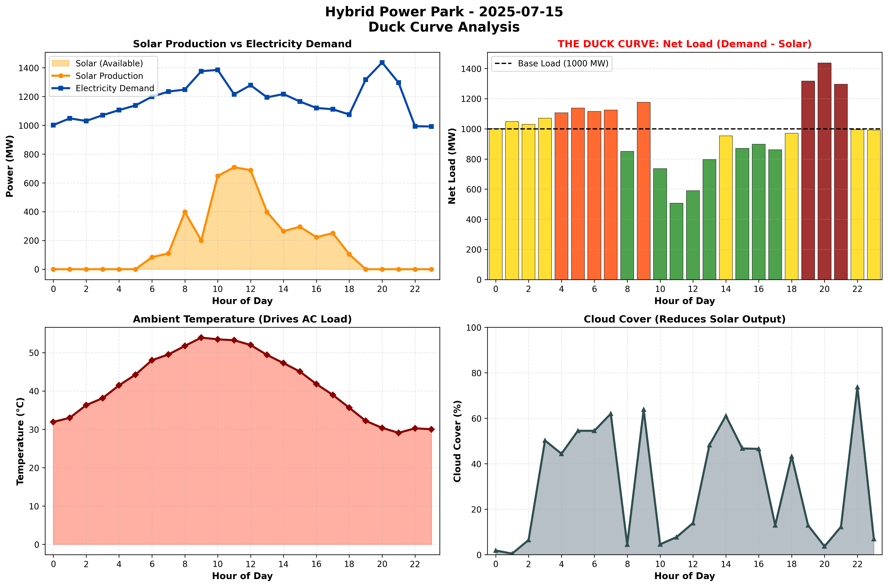

# ☀️ SolarCOptimizer Backend

This repository contains the machine learning backend for the **SolarCOptimizer** project, part of the Google Solution Challenge 2026.

This powerful backend provides an intelligent API to forecast energy supply/demand and generate an economically optimal power dispatch schedule for a hybrid solar and coal power park.

---

## 🎯 The Problem: The "Duck Curve"

The project tackles the "duck curve" problem, a major challenge in modern power grids. As solar power floods the grid during the day, traditional power plants (like coal) must ramp down. However, as the sun sets, solar power vanishes, and the grid experiences a massive, rapid increase in net demand. This requires traditional plants to ramp up extremely quickly, which is inefficient, costly, and mechanically stressful.

**SolarCOptimizer** provides a 24-hour advance schedule to manage this transition smoothly and cost-effectively.

<p align="center">
  
</p>

## ✨ Key Features

-   **Intelligent Forecasting**: Utilizes two `scikit-learn` models to predict 24-hour solar generation and grid demand with hourly granularity.
-   **Economic Dispatch Optimization**: Implements a sophisticated optimization model using **Google OR-Tools** to create the most cost-effective schedule for the coal plant.
-   **Constraint-Based Modeling**: The optimizer respects real-world physical constraints, including the coal plant's minimum/maximum generation limits and its ramp-up/ramp-down rates.
-   **Proactive Alerts**: The API output includes critical alerts, such as identifying potential energy shortages when demand exceeds the system's physical capacity.
-   **API-First Design**: Built with **FastAPI**, providing a modern, high-performance, and self-documenting API for easy integration.
-   **Containerized & Ready for Deployment**: Includes a multi-stage `Dockerfile` for building a lightweight, production-ready container.


## 🛠️ Technology Stack

| Component         | Technology                                                                                             |
| ----------------- | ------------------------------------------------------------------------------------------------------ |
| **Web Framework** | FastAPI                                                               |
| **ML Models**     | Scikit-learn (XgBoost Regressor)                                |
| **Optimization**  | Google OR-Tools                          |
| **Data Handling** | Pandas, NumPy                                       |
| **Validation**    | Pydantic                                                                 |
| **Serving**       | Uvicorn                                |
| **Container**     | Docker                                                                      |

---

---

## Getting Started

### Prerequisites
-   Python 3.11+
-   `pip` and `venv`

### Installation & Setup

1.  **Clone the repository:**
    ```bash
    git clone https://github.com/<your-github-username>/SolarCOptimizer.git
    cd SolarCOptimizer
    ```

2.  **Create and activate a virtual environment:**
    ```bash
    # For macOS/Linux
    python3 -m venv .venv
    source .venv/bin/activate

    # For Windows
    python -m venv .venv
    .venv\Scripts\activate
    ```

3.  **Install the required dependencies:**
    ```bash
    pip install -r requirements.txt
    ```

### Running the Application

1.  **Start the development server:**
    ```bash
    uvicorn app.main:app --reload
    ```

2.  **Access the API:**
    The application will be running at `http://127.0.0.1:8000`.

3.  **Explore the Interactive Docs:**
    For a full, interactive API documentation (powered by Swagger UI), navigate to:
    **http://127.0.0.1:8000/docs**

---